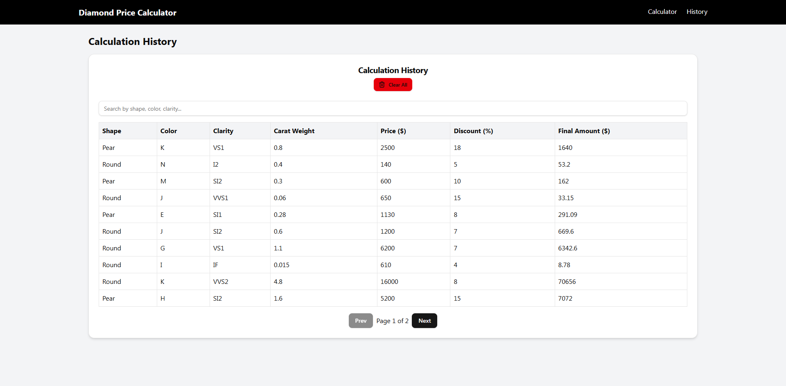

# 💎 Diamond Price Calculator (MERN Stack)

A full-stack application built with the **MERN stack (MongoDB, Express, React, Node.js)** that allows users to calculate diamond prices based on carat weight, clarity, color, and shape.  
It also maintains a history of all calculations for reference.

---

## 🚀 Features
- Import diamond price data from JSON into MongoDB
- Calculate diamond price with:
  - Shape
  - Color
  - Clarity
  - Carat Weight
  - Discount (%)
- Dynamic calculation of **base price, price per carat, and final price**
- History tracking (stored in MongoDB)
- Option to **clear all history**
- Professional UI with **React + TailwindCSS + ShadCN UI**
- Responsive and clean design
- Currency support for **INR (₹)** with proper formatting

---

## 🛠️ Tech Stack
### Frontend:
- React (Vite)
- Tailwind CSS
- ShadCN UI
- Axios
- React Router

### Backend:
- Node.js
- Express.js
- MongoDB (Mongoose)
- dotenv
- Nodemon

---

## 📂 Project Structure
```
diamond-price-calculator/
├── backend/
│   ├── src/
│   │   ├── controllers/
│   │   │   ├── calculator.controller.js
│   │   │   └── history.controller.js
│   │   ├── models/
│   │   │   ├── Diamond.js
│   │   │   └── History.js
│   │   ├── routes/
│   │   │   ├── calculator.routes.js
│   │   │   └── history.routes.js
│   │   ├── utils/
│   │   │   └── importDiamonds.js
│   │   └── server.js
│   └── package.json
│
├── frontend/
│   ├── src/
│   │   ├── components/
│   │   │   ├── Calculator.jsx
│   │   │   ├── HistoryTable.jsx
│   │   │   ├── DiamondTable.jsx
│   │   │   └── Navbar.jsx
│   │   ├── pages/
│   │   │   ├── CalculatorPage.jsx
│   │   │   └── HistoryPage.jsx
│   │   ├── App.jsx
│   │   └── main.jsx
│   └── package.json
└── README.md
```

---

## ⚡ Setup Instructions

### 1️⃣ Clone the repo
```bash
git clone https://github.com/harshmistry7/diamond-price-calculator.git
cd diamond-price-calculator
```

### 2️⃣ Backend Setup
```bash
cd backend
npm install
```

Create a `.env` file:
```env
MONGO_URI=your_mongodb_connection_string
PORT=5000
```

Import diamond data:
```bash
node src/utils/importDiamonds.js
```

Run backend:
```bash
npm run dev
```
Server runs on → `http://localhost:5000`

---

### 3️⃣ Frontend Setup
```bash
cd ../frontend
npm install
```

Run frontend:
```bash
npm run dev
```
Frontend runs on → `http://localhost:5173`

---

## 🔗 API Endpoints

### Diamonds
- `GET /api/diamonds` → Fetch all diamonds
- `POST /api/calculate` → Calculate diamond price

### History
- `GET /api/history` → Get calculation history
- `DELETE /api/history` → Clear history

---

## 📸 Screenshots

- Calculator Page  
  

- History Page  
  

---

## 👨‍💻 Author
**Harsh Mistry**  
B.Tech IT Student | Full Stack Developer (MERN & Spring Boot)  

---
